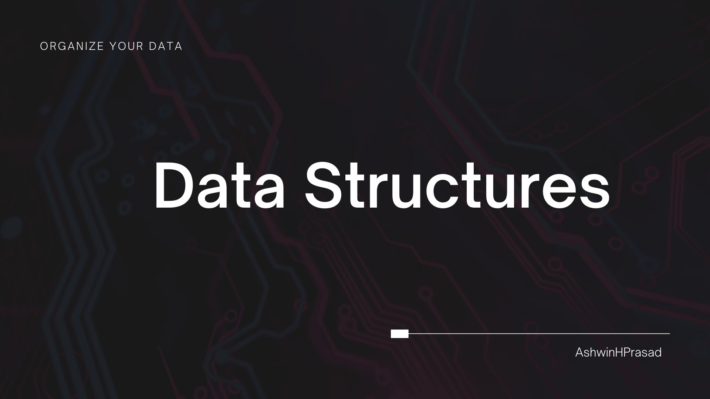

# Data Structures

 

This repo contains the implementation of data structures in c++.

1. C++
   1. Array
      - Stack as an Array
      - Queue as an Array
      - Circular Queue
      - Double Ended Eueue 
   2. Linked Lists
       - Stack as a Linked List
       - Queue as a Linked List
   3. Trees
        - Binary Search Tree
